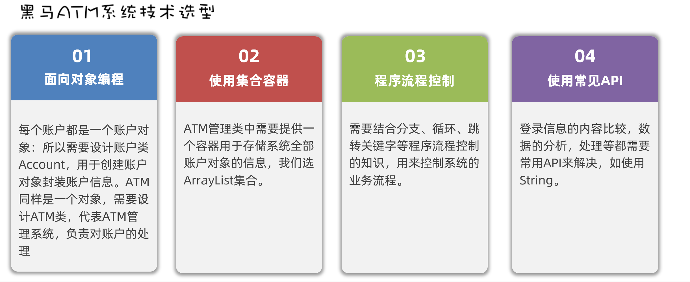
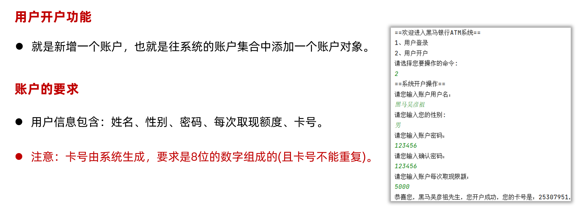
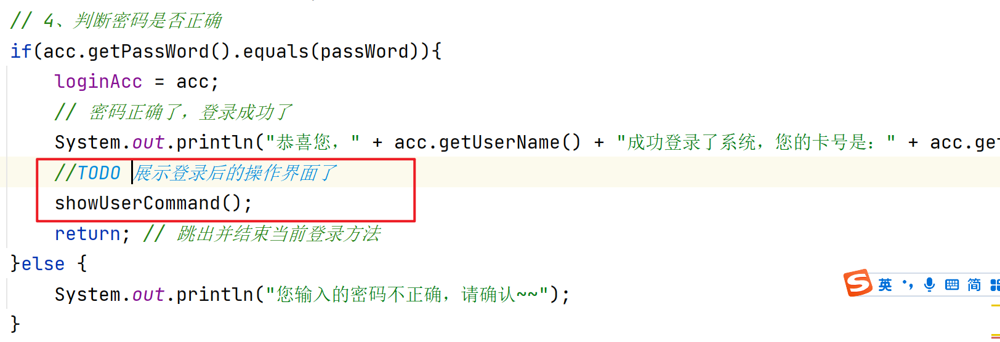
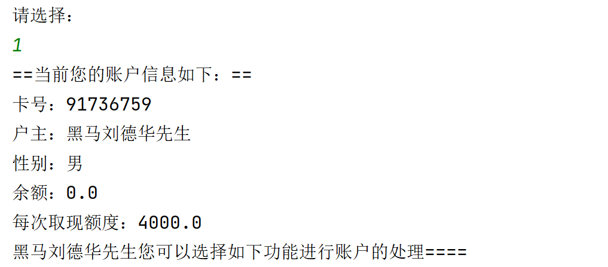
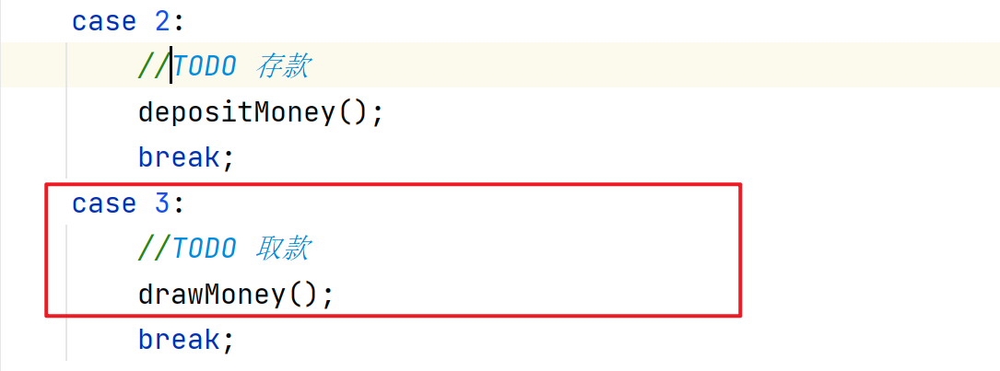
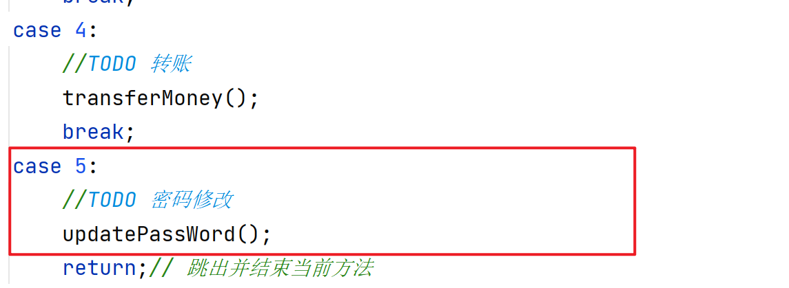
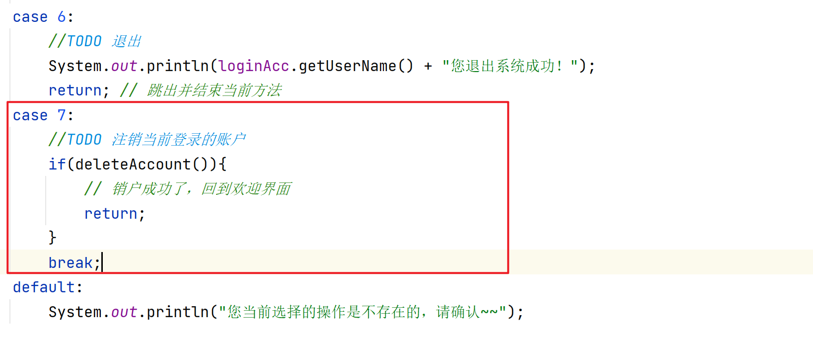

# day09——Java基础项目（ATM系统）

各位同学，恭喜大家，学完前面的课程内容之后，就算对Java语言开发程序成功入门了。接下来我们就可以使用Java语言开发一个小项目了——ATM系统。

## 一、ATM项目介绍

**1. ATM系统功能介绍**

大家都应该去过银行的ATM机上取过钱，每次取钱的时候，首先需要用户把卡插入机器，然后机器会自动读取你的卡号，由用户输入密码，如果密码校验通过，就会进入ATM机的主操作界面：**有查询、取款、存款、转账等业务功能**，用户选择哪个功能就执行对应预先设定好的程序。


由于没有图形化界面编程，所以我们是做不出界面效果的，但是我们可以在控制台模拟ATM机的各项功能。

如下图所示：运行程序时，进入登录界面，在此界面可以登录、或者开户。


- 在登录界面，如果用户录入2就进入**用户开户**的功能：如下图所示


- 在登录界面，如果用户录入1就进入**用户登录**的功能：如下图所示：


各位同学，你可能会觉得这个案例功能怎么这么多啊！ 太复杂了，其实也没你想得那么复杂。接下来，我将手把手带领大家把这个ATM系统完成。

**2. ATM系统中我们会用到哪些技术呢？**

如下图所示：该项目涵盖了我们前面所学习的所有知识点，包括面向对象编程、集合容器的使用、流程控制、常用的API（比如String的运用）等。



**3. 完成ATM系统，我们能收获什么**


## 二、项目架构搭建、欢迎界面设计

接下来，我们带着大家开始开发这个ATM系统。首先我们来完成项目的架构搭建、和欢迎界面的设计。

首先我们来分析一下，开发这个ATM系统的流程：

- 由于每一个账户都包含一些个人信息，比如：卡号、姓名、性别、密码、余额、每次取现额度等等。所以，首先可以设计一个Account类，用来描述账户对象需要封装那些数据。

- 紧接着，定义一个ATM类，用来表示ATM系统，负责提供所有的业务需求。

  比如：展示ATM系统的欢迎页面、开户、登录、转账等功能。

- 最后，定义一个测试类Test，负责启动我们开发好的ATM系统，进行测试。

> 第一步：先来完成Account类的编写

```java
//首先可以设计一个Account类，来描述账户对象需要封装哪些数据。
public class Account {
    private String cardId; //卡号
    private String userName; //用户名
    private char sex; //性别
    private String passWord;//密码
    private double money; //余额
    private double limit; // 限额

    public String getCardId() {
        return cardId;
    }

    public void setCardId(String cardId) {
        this.cardId = cardId;
    }

    public String getUserName() {
        return userName + ( sex  == '男' ? "先生" : "女士");
    }

    public void setUserName(String userName) {
        this.userName = userName;
    }

    public char getSex() {
        return sex;
    }

    public void setSex(char sex) {
        this.sex = sex;
    }

    public String getPassWord() {
        return passWord;
    }

    public void setPassWord(String passWord) {
        this.passWord = passWord;
    }

    public double getMoney() {
        return money;
    }

    public void setMoney(double money) {
        this.money = money;
    }

    public double getLimit() {
        return limit;
    }

    public void setLimit(double limit) {
        this.limit = limit;
    }
}
```

> 第二步：编写一个ATM类，负责对每一个账户对象进行管理

```java
public class ATM {
    //创建一个存储账户对象的集合；后面每开一个账户，就往集合中添加一个账户对象
    private ArrayList<Account> accounts = new ArrayList<>();    
}
```

> 第三步：在ATM类中，编写欢迎界面

```java
public class ATM {
    //创建一个存储账户对象的集合；后面每开一个账户，就往集合中添加一个账户对象
    private ArrayList<Account> accounts = new ArrayList<>(); 
    //为了后面键盘录入方便一点，先创建好一个Scanner对象
    private Scanner sc = new Scanner(System.in);
    
    /**启动ATM系统 展示欢迎界面 */
    public void start(){
        while (true) {
            System.out.println("===欢迎您进入到了ATM系统===");
            System.out.println("1、用户登录");
            System.out.println("2、用户开户");
            System.out.println("请选择：");
            int command = sc.nextInt();
            switch (command){
                case 1:
                    // 用户登录
                    System.out.println("进入登录功能");
                    break;
                case 2:
                    // 用户开户
                   	System.out.println("进入开户功能");
                    break;
                default:
                    System.out.println("没有该操作~~");
            }
        }
    }
}
```

## 三、开户功能实现

接下来，我们完成**开户功能**的实现。需求如下：



为了系统的代码结构更加清晰，在ATM类中，写一个开户的方法。

步骤如下：

> -  1、创建一个账户对象，用于封装用户的开户信息
> -  2、需要用户输入自己的开户信息，赋值给账户对象
>   - 输入账户名，设置给账户对象
>   - 输入性别，如果性别是`'男'`或者`'女'`，将性别设置给账户对象；否则重新录入性别知道录入正确为止。
>   - 输入账户、并且输入两次密码，只有两次密码相同，才将账户和密码设置给账户对象。
>   - 输入提现限额，并且设置给账户对象
> - 3、输出开户成功，的提示语句。

```java
/** 完成用户开户操作  */
private void createAccount(){
    System.out.println("==系统开户操作==");
    // 1、创建一个账户对象，用于封装用户的开户信息
    Account acc = new Account();

    // 2、需要用户输入自己的开户信息，赋值给账户对象
    System.out.println("请您输入您的账户名称：");
    String name = sc.next();
    acc.setUserName(name);

    while (true) {
        System.out.println("请您输入您的性别：");
        char sex = sc.next().charAt(0); // "男"
        if(sex == '男' || sex == '女'){
            acc.setSex(sex);
            break;
        }else {
            System.out.println("您输入的性别有误~只能是男或者女~");
        }
    }

    while (true) {
        System.out.println("请您输入您的账户密码：");
        String passWord  = sc.next();
        System.out.println("请您输入您的确认密码：");
        String okPassWord  = sc.next();
        // 判断2次密码是否一样。
        if(okPassWord.equals(passWord)){
            acc.setPassWord(okPassWord);
            break;
        }else {
            System.out.println("您输入的2次密码不一致，请您确认~~");
        }
    }

    System.out.println("请您输入您的取现额度：");
    double limit = sc.nextDouble();
    acc.setLimit(limit);

    // 重点：我们需要为这个账户生成一个卡号（由系统自动生成。8位数字表示，不能与其他账户的卡号重复：会在下节课详细讲解）
    //TODO 这里先留着，待会把生成卡号的功能写好，再到这里调用

    // 3、把这个账户对象，存入到账户集合中去
    accounts.add(acc);
    System.out.println("恭喜您，" + acc.getUserName() + "开户成功，您的卡号是：" + acc.getCardId());
}
```

到这里，开户功能其实只完成的一大半。如果细心的同学可能会发现，开户功能中并没有给账户设置卡号。

因为生成卡号比较麻烦，所以在下一节，我们单独来写一个方法用于生成卡号。

## 四、生成卡号

各位同学，刚才在完成开户功能的时候，并没有生成卡号，所以我们接着把生成卡号的功能完成。

> 第一步：先在ATM类中，写一个判断卡号是否存在的功能。
>
> - 遍历存储Account对象的集合，得到每一个Account对象，获取对象的卡号
>
> - 如果卡号存在，返回该卡号对应的Account对象
>
> - 如果卡号不存在，返回null

```java
/** 根据卡号查询账户对象返回 accounts = [c1, c2, c3 ...]*/
private Account getAccountByCardId(String cardId){
    // 遍历全部的账户对象
    for (int i = 0; i < accounts.size(); i++) {
        Account acc = accounts.get(i);
        // 判断这个账户对象acc中的卡号是否是我们要找的卡号
        if(acc.getCardId().equals(cardId)){
            return acc;
        }
    }
    return null; // 查无此账户，这个卡号不存在的
}
```

> 第二步：再在ATM类中，写一个生成卡号的功能
>
> - 1、先随机产生8个[0,9]范围内的随机数，拼接成一个字符串
>- 2、然后再调用getAccountByCardId方法，判断这个卡号字符串是否存在
> - 3、判断生成的卡号是否存在
>  - 如果生成的卡号不存在，说明生成的卡号是有效的，把卡号返回，
>   - 如果生成的卡号存在，说明生成的卡号无效，循环继续生产卡号。

```java
/** 返回一个8位 数字的卡号，而且这个卡号不能与其他账户的卡号重复 */
private String createCardId(){
    while (true) {
        // 1、定义一个String类型的变量记住8位数字作为一个卡号
        String cardId = "";
        // 2、使用循环，循环8次，每次产生一个随机数给cardId连接起来
        Random r = new Random();
        for (int i = 0; i < 8; i++) {
            int data = r.nextInt(10); // 0 - 9
            cardId += data;
        }
        // 3、判断cardId中记住的卡号，是否与其他账户的卡号重复了，没有重复，才可以做为一个新卡号返回。
        Account acc = getAccountByCardId(cardId);
        if(acc == null){
            // 说明cardId没有找到账户对象，因此cardId没有与其他账户的卡号重复，可以返回它做为一个新卡号
            return cardId;
        }
    }
}
```

写完生成卡号的功能后，在开户功能的`TODO`位置，调用生成卡号的功能，并且将生成的卡号设置到账户对象中。


## 五、登录功能

各位同学，在上面我们已经完成了开户功能。接下来我们来编写登录功能，编写登录功能的时候我们要满足一下需求：

① 如果系统没有任何账户对象，则不允许登录。

② 让用户输入登录的卡号，先判断卡号是否正确，如果不正确要给出提示。

③ 如果卡号正确，再让用户输入账户密码，如果密码不正确要给出提示，如果密码也正确，则给出登录成功的提示。

> 登录功能具体实现步骤如下：
>
> -  1、判断系统中是否存在账户对象，存在才能登录，如果不存在，我们直接结束登录操作
> -  2、输入登录的卡号，并判断卡号是否存在
> - 3、如果卡号不存在，直接给出提示
> - 4、如果卡号存在，接着输入用户密码，并判断密码是否正确
> - 5、如果密码也正确，则登录成功，并且记录当前的登录账户

```java
/** 完成用户的登录操作 */
private void login(){
    System.out.println("==系统登录==");
    // 1、判断系统中是否存在账户对象，存在才能登录，如果不存在，我们直接结束登录操作
    if(accounts.size() == 0){
        System.out.println("当前系统中无任何账户，请先开户再来登录~~");
        return; // 跳出登录操作。
    }

    // 2、系统中存在账户对象，可以开始进行登录操作了
    while (true) {
        System.out.println("请您输入您的登录卡号：");
        String cardId = sc.next();
        // 3、判断这个卡号是否存在啊？
        Account acc = getAccountByCardId(cardId);
        if(acc == null){
            // 说明这个卡号不存在。
            System.out.println("您输入的登录卡号不存在，请确认~~");
        }else {
            while (true) {
                // 卡号存在了，接着让用户输入密码
                System.out.println("请您输入登录密码：");
                String passWord = sc.next();
                // 4、判断密码是否正确
                if(acc.getPassWord().equals(passWord)){
                    loginAcc = acc;
                    // 密码正确了，登录成功了
                    System.out.println("恭喜您，" + acc.getUserName() + "成功登录了系统，您的卡号是：" + acc.getCardId());
                    //TODO 把展示登录界面的功能写成一个方法，写好了再回来调用。                   
                    return; // 跳出并结束当前登录方法
                }else {
                    System.out.println("您输入的密码不正确，请确认~~");
                }
            }
        }
    }
}
```

## 六、展示用户操作界面

登录成功之后，需要显示登录后的用户操作界面。效果如下


写成一个方法，用来展示登录成功的操作界面，代码如下：

```java
/** 展示登录后的操作界面的 */
private void showUserCommand(){
    while (true) {
        System.out.println(loginAcc.getUserName() + "您可以选择如下功能进行账户的处理====");
        System.out.println("1、查询账户");
        System.out.println("2、存款");
        System.out.println("3、取款");
        System.out.println("4、转账");
        System.out.println("5、密码修改");
        System.out.println("6、退出");
        System.out.println("7、注销当前账户");
        System.out.println("请选择：");
        int command = sc.nextInt();
        switch (command){
            case 1:
                //TODO 查询当前账户
                break;
            case 2:
                //TODO 存款
                break;
            case 3:
                //TODO取款
                break;
            case 4:
                //TOD 转账
                break;
            case 5:
                //TODO 密码修改
                return;// 跳出并结束当前方法
            case 6:
                //TODO 退出
                System.out.println(loginAcc.getUserName() + "您退出系统成功！");
                return; // 跳出并结束当前方法
            case 7:
                // 注销当前登录的账户
                if(deleteAccount()){
                    // 销户成功了，回到欢迎界面
                    return;
                }
                break;
            default:
                System.out.println("您当前选择的操作是不存在的，请确认~~");
        }
    }
}
```

写好用户操作界面的方法之后，再到登录成功的位置调用，登录成功后，马上显示用户操作界面。刚才在哪里打了一个`TODO`标记的，回去找找。



到这里，登录功能就写好了。


## 六、查询账户、退出

- 查询账户：在用户操作界面，选择1查询当前账户信息。效果如下：



登录成功的时候，已经把当前账户对象用一个成员变量存储了 ，所以直接按照如下格式打印账户对象的属性信息即可。

这里也写成一个方法

```java
/**
展示当前登录的账户信息
*/
private void showLoginAccount(){
    System.out.println("==当前您的账户信息如下：==");
    System.out.println("卡号：" + loginAcc.getCardId());
    System.out.println("户主：" + loginAcc.getUserName());
    System.out.println("性别：" + loginAcc.getSex());
    System.out.println("余额：" + loginAcc.getMoney());
    System.out.println("每次取现额度：" + loginAcc.getLimit());
}
```

写好方法之后，到用户操作界面调用。如下图所示


- 退出功能：其实就是将ATM系统中，在用户界面选择6时，直接结束程序。


## 七、存款

各位同学，接下来来完成存款操作。

> 我们把存款功能也写成一个方法，具体步骤如下：
>
> - 1. 键盘录入要存入的金额
> - 2. 在原有余额的基础上，加上存入金额，得到新的余额
> - 3. 再将新的余额设置给当前账户对象

```java
/** 存钱 */
private void depositMoney() {
    System.out.println("==存钱操作==");
    System.out.println("请您输入存款金额：");
    double money = sc.nextDouble();

    // 更新当前登录的账户的余额。
    loginAcc.setMoney(loginAcc.getMoney() + money);
    System.out.println("恭喜您，您存钱：" + money + "成功，存钱后余额是：" + loginAcc.getMoney());
}
```

写好存款的方法之后，在`case 2:`的下面调用`depositMoney()`方法


到这里，存款功能就写好了。


## 八、取款

各位同学，接下来我们写一下取款的功能。

> 把取款的功能也写成一个方法，具体步骤如下
>
> - 1、判断账户余额是否达到了100元，如果不够100元，就不让用户取钱了
>
> - 2、让用户输入取款金额
>
> - 3、判断账户余额是否足够
>
>   - 如果余额足够， 继续判断当前取款金额是否超过了每次限额
>
>     - 如果超过限额，提示“每次只能取xxx限额的钱”
>
>     - 如果不超过限额，则在当前余额上减去取钱的金额，得到新的余额
>
>       并将新的余额设置给账户对象。
>
>   - 如果余额不足，提示“你的余额不足，你的账户余额是xxx元”

按照上面分析的步骤，代码如下

```java
/** 取钱 */
private void drawMoney() {
    System.out.println("==取钱操作==");
    // 1、判断账户余额是否达到了100元，如果不够100元，就不让用户取钱了
    if(loginAcc.getMoney() < 100){
        System.out.println("您的账户余额不足100元，不允许取钱~~");
        return;
    }

    // 2、让用户输入取款金额
    while (true) {
        System.out.println("请您输入取款金额：");
        double money = sc.nextDouble();

        // 3、判断账户余额是否足够
        if(loginAcc.getMoney() >= money){
            // 账户中的余额是足够的
            // 4、判断当前取款金额是否超过了每次限额
            if(money > loginAcc.getLimit()){
                System.out.println("您当前取款金额超过了每次限额，您每次最多可取：" + loginAcc.getLimit());
            }else {
                // 代表可以开始取钱了。更新当前账户的余额即可
                loginAcc.setMoney(loginAcc.getMoney() - money);
                System.out.println("您取款：" + money + "成功，取款后您剩余：" + loginAcc.getMoney());
                break;
            }
        }else {
            System.out.println("余额不足，您的账户中的余额是：" + loginAcc.getMoney());
        }
    }
}
```

写好取钱方法之后，在`case 3:`的位置调用`drawMoney()`方法




## 九、转账

各位同学，接下来我们来编写转账的功能。转账的意思就是，将一个账户的钱转入另一个账，具体的转账逻辑如下：

> 我们把转账功能也写成一个方法
>
> - 1、判断系统中是否存在其他账户
>
> - 2、判断自己的账户中是否有钱
>
> - 3、真正开始转账了，输入对方卡号
>
> - 4、判断对方卡号是否正确啊？
>
> - 5、如果卡号正确，就继续让用户输入姓氏， 并判断这个姓氏是否正确？
>
>   - 如果姓氏不正确，给出提示“对不起，您姓氏有问题，转账失败！”
>
> - 6、如果姓氏正确，继续判断这个转账金额是否超过自己的余额。
>
>   - 如果转账金额超过余额，给出提示“对不起，余额不足，转账失败！”
>
> - 7、如果对方卡号存在、姓氏匹配、余额足够，就完成真正的转账操作
>
>   - 获取当前自己账户的余额，减去转账金额，就可以得到自己账户新的余额，
>
>     并将新的余额，设置给当前账户
>
>   - 并且获取对方的账户余额，加上转账金额，就可以得到对方账户新的余额，
>
>     并将新的余额，设置给对方账户
>
>   - 给出提示：“您转账成功了~~~”

```java
/** 转账 */
private void transferMoney() {
    System.out.println("==用户转账==");
    // 1、判断系统中是否存在其他账户。
    if(accounts.size() < 2){
        System.out.println("当前系统中只有你一个账户，无法为其他账户转账~~");
        return;
    }

    // 2、判断自己的账户中是否有钱
    if(loginAcc.getMoney() == 0){
        System.out.println("您自己都没钱，就别转了~~");
        return;
    }

    while (true) {
        // 3、真正开始转账了
        System.out.println("请您输入对方的卡号：");
        String cardId = sc.next();

        // 4、判断这个卡号是否正确啊？？
        Account acc = getAccountByCardId(cardId);
        if(acc == null){
            System.out.println("您输入的对方的卡号不存在~~");
        }else {
            // 对方的账户存在，继续让用户认证姓氏。
            String name = "*" + acc.getUserName().substring(1); // * + 马刘德华
            System.out.println("请您输入【" + name + "】的姓氏：");
            String preName = sc.next();
            // 5、判断这个姓氏是否正确啊
            if(acc.getUserName().startsWith(preName)) {
                while (true) {
                    // 认证通过了：真正转账了
                    System.out.println("请您输入转账给对方的金额：");
                    double money = sc.nextDouble();
                    // 6、判断这个金额是否没有超过自己的余额。
                    if(loginAcc.getMoney() >= money){
                        // 7、转给对方了
                        // 更新自己的账户余额
                        loginAcc.setMoney(loginAcc.getMoney() - money);
                        // 更新对方的账户余额
                        acc.setMoney(acc.getMoney() + money);
                        System.out.println("您转账成功了~~~");
                        return; // 跳出转账方法。。
                    }else {
                        System.out.println("您余额不足，无法给对方转这么多钱，最多可转：" + loginAcc.getMoney());
                    }
                }
            }else {
                System.out.println("对不起，您认证的姓氏有问题~~");
            }
        }
    }
}
```

写好修改转账功能之后，在`case 4:`这里调用。如下：


到这里，转账功能就写好了。


## 十、修改密码

各位同学，接下来我们完成修改密码的功能。

> 把修改密码的功能也是写成一个方法，具体步骤如下
>
> - 1、提醒用户输入当前密码
>
> - 2、认证当前密码是否正确
>   - 如果认证密码错误，提示“您当前输入的密码不正确~~”；重新输入密码，再次认证密码是否正确。
>
> - 3、如果认证密码正确，开始修改密码，修改密码时需要用户输入2次新密码
> - 4、判断2次 密码是否一致
>   - 如果两次密码一致，就将新密码设置给当前账户对象，密码修改成功
>   - 如果两次密码不一直，则给出提示“您输入的2次密码不一致~~”；重新输入新密码，并确认密码。

```java
/** 账户密码修改 */
private void updatePassWord() {
    System.out.println("==账户密码修改操作==");
    while (true) {
        // 1、提醒用户认证当前密码
        System.out.println("请您输入当前账户的密码：");
        String passWord = sc.next();

        // 2、认证当前密码是否正确啊
        if(loginAcc.getPassWord().equals(passWord)){
            // 认证通过
            while (true) {
                // 3、真正开始修改密码了
                System.out.println("请您输入新密码：");
                String newPassWord = sc.next();

                System.out.println("请您再次输入密码：");
                String okPassWord = sc.next();

                // 4、判断2次 密码是否一致
                if(okPassWord.equals(newPassWord)){
                    // 可以真正开始修改密码了
                    loginAcc.setPassWord(okPassWord);
                    System.out.println("恭喜您，您的密码修改成功~~~");
                    return;
                }else {
                    System.out.println("您输入的2次密码不一致~~");
                }
            }
        }else {
            System.out.println("您当前输入的密码不正确~~");
        }
    }
}
```

写好修改密码的功能之后。在`case 5:`的位置调用`updatePassWord()`方法。如下图所示



好了，到这里修改密码的功能就写好了。


## 十一、注销

各位同学，接下来我们完成最后一个功能，注销功能。

> 这里把注销功能也写成一个方法，具体步骤如下
>
> - 1、先确认是否需要注销账户，让用户输入y或者n
>   - 如果输入y，表示确认
>   - 如果输入n，表示取消注销操作
> - 2、输入y后，继续判断当前用户的账户是否有钱
>   - 如果账户有钱，提示：“对不起，您的账户中存钱金额，不允许销”
>   - 如果账户没有钱，则把当前账户对象，从系统的集合中删除，完成注销。

按照上面的步骤代码如下

```java
/** 销户操作 */
private boolean deleteAccount() {
    System.out.println("==进行销户操作==");
    // 1、问问用户是否确定要销户啊
    System.out.println("请问您确认销户吗？y/n");
    String command = sc.next();
    switch (command) {
        case "y":
            // 确实要销户
            // 2、判断用户的账户中是否有钱：loginAcc
            if(loginAcc.getMoney() == 0) {
                // 真的销户了
                accounts.remove(loginAcc);
                System.out.println("您好，您的账户已经成功销户~~");
                return true;
            }else {
                System.out.println("对不起，您的账户中存钱金额，不允许销户~~");
                return false;
            }
        default:
            System.out.println("好的，您的账户保留！！");
            return false;
    }
}
```

注销功能写好之后，在用户操作界面的`case 7:`位置调用`deleteAccount()`的方法。

代码如下



---

到这里注销账户的功能就写好了。