# day14-单元测试、反射

恭喜同学们，Java主要的知识我们其实已经学习得差不多了。今天同学们再把单元测试、反射、注解、动态代理学习完。Java的基础知识就算全齐活了。

首先，我们进入单元测试的学习。

## 一、单元测试

### 1.1 单元测试快速入门

所谓单元测试，就是针对最小的功能单元，编写测试代码对其进行正确性测试。

我们想想，咱们之前是怎么进行测试的呢？

比如说我们写了一个学生管理系统，有添加学生、修改学生、删除学生、查询学生等这些功能。要对这些功能这几个功能进行测试，我们是在main方法中编写代码来测试的。

但是在main方法中写测试代码有如下的几个问题，如下图所示：


为了测试更加方便，有一些第三方的公司或者组织提供了很好用的测试框架，给开发者使用。这里给同学们介绍一种Junit测试框架。

Junit是第三方公司开源出来的，用于对代码进行单元测试的工具（IDEA已经集成了junit框架）。相比于在main方法中测试有如下几个优点。


----

我们知道单元测试是什么之后，接下来带领同学们使用一下。由于Junit是第三方提供的，所以我们需要把jar包导入到我们的项目中，才能使用，具体步骤如下图所示：


接下来，我们就按照上面的步骤，来使用一下.

先准备一个类，假设写了一个StringUtil工具类，代码如下

```java
public class StringUtil{
    public static void printNumber(String name){
        System.out.println("名字长度："+name.length());
    }
}
```

接下来，写一个测试类，测试StringUtil工具类中的方法能否正常使用。

```java
public class StringUtilTest{
    @Test
    public void testPrintNumber(){
        StringUtil.printNumber("admin");
        StringUtil.printNumber(null);
    }
}
```

写完代码之后，我们会发现测试方法左边，会有一个绿色的三角形按钮。点击这个按钮，就可以运行测试方法。


### 1.2 单元测试断言

接下来，我们学习一个单元测试的断言机制。**所谓断言：意思是程序员可以预测程序的运行结果，检查程序的运行结果是否与预期一致。**

我们在StringUtil类中新增一个测试方法

```java
 public static int getMaxIndex(String data){
     if(data == null){
         return -1;
     }
     return data.length();
 }
```

接下来，我们在StringUtilTest类中写一个测试方法

```java
public class StringUtilTest{
    @Test
    public void testGetMaxIndex(){
       int index1 = StringUtil.getMaxIndex(null);
       System.out.println(index1);
        
       int index2 = StringUtil.getMaxIndex("admin");
       System.out.println(index2);
        
        //断言机制：预测index2的结果
        Assert.assertEquals("方法内部有Bug",4,index2);
    }
}
```

运行测试方法，结果如下图所示，表示我们预期值与实际值不一致


### 1.3 Junit框架的常用注解

同学们，刚才我们以及学习了@Test注解，可以用来标记一个方法为测试方法，测试才能启动执行。

除了@Test注解，还有一些其他的注解，我们要知道其他注解标记的方法什么时候执行，以及其他注解在什么场景下可以使用。

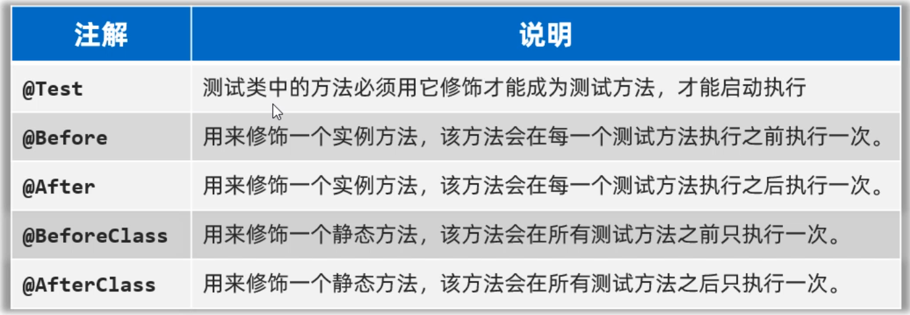

接下来，我们演示一下其他注解的使用。我们在StringUtilTest测试类中，再新增几个测试方法。代码如下

```java
public class StringUtilTest{
    @Before
    public void test1(){
        System.out.println("--> test1 Before 执行了");
    }
    @BeforeClass
    public static void test11(){
        System.out.println("--> test11 BeforeClass 执行了");
    }
    @After
    public void test2(){
        System.out.println("--> test2 After 执行了");
    }
    @AfterCalss
    public static void test22(){
        System.out.println("--> test22 AfterCalss 执行了");
    }
}
```

执行上面的测试类，结果如下图所示，观察执行结果特点如下

```java
1.被@BeforeClass标记的方法,执行在所有方法之前
2.被@AfterCalss标记的方法，执行在所有方法之后
3.被@Before标记的方法，执行在每一个@Test方法之前
4.被@After标记的方法，执行在每一个@Test方法之后
```

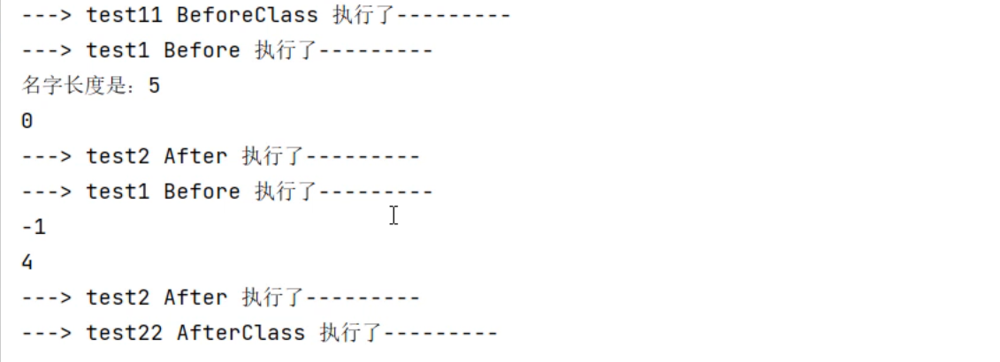

我们现在已经知道每一个注解的作用了，那他们有什么用呢？应用场景在哪里?

我们来看一个例子，假设我想在每个测试方法中使用Socket对象，并且用完之后，需要把Socket关闭。代码就可以按照下面的结构来设计

```java
public class StringUtilTest{
    private static Socket socket;
    @Before
    public void test1(){
        System.out.println("--> test1 Before 执行了");
    }
    @BeforeClass
    public static void test11(){
        System.out.println("--> test11 BeforeClass 执行了");
        //初始化Socket对象
        socket = new Socket();
    }
    @After
    public void test2(){
        System.out.println("--> test2 After 执行了");
    }
    @AfterCalss
    public static void test22(){
        System.out.println("--> test22 AfterCalss 执行了");
         //关闭Socket
        socket.close();
    }
}
```

最后，我们再补充一点。前面的注解是基于Junit4版本的，再Junit5版本中对注解作了更新，但是作用是一样的。所以这里就不做演示了


## 二、反射

各位小伙伴，接下来我们要学习反射技术。在学习反射之前，有几个点需要给同学们提前交代一下，接下来我们学习的反射、动态代理、注解等知识点，在以后开发中极少用到，这些技术都是以后学习框架、或者做框架的底层源码。给同学们讲这些技术的目的，是为了以后我们理解框架、或者自己开发框架给别人用作铺垫的。同时由于这些技术非常抽象，所以按照国际惯例，我们都会采用先带着大家充分的认识它们，然后再了解其作用和应用场景。

接下来，我们就需要带着同学们认识一下什么是反射。其实API文档中对反射有详细的说明，我们去了解一下。在java.lang.reflect包中对反射的解释如下图所示


翻译成人话就是：**反射技术，指的是加载类的字节码到内存，并以编程的方法解刨出类中的各个成分（成员变量、方法、构造器等）。**

反射有啥用呢？其实反射是用来写框架用的，但是现阶段同学们对框架还没有太多感觉。为了方便理解，我给同学们看一个我们见过的例子：平时我们用IDEA开发程序时，用对象调用方法，IDEA会有代码提示，idea会将这个对象能调用的方法都给你列举出来，供你选择，如果下图所示


问题是IDEA怎么知道这个对象有这些方法可以调用呢? 原因是对象能调用的方法全都来自于类，IDEA通过反射技术就可以获取到类中有哪些方法，并且把方法的名称以提示框的形式显示出来，所以你能看到这些提示了。

那记事本写代码为什么没有提示呢? 因为技术本软件没有利用反射技术开发这种代码提示的功能，哈哈！！

好了，认识了反射是什么之后，接下来我还想给同学们介绍一下反射具体学什么？

因为反射获取的是类的信息，那么反射的第一步首先获取到类才行。由于Java的设计原则是万物皆对象，获取到的类其实也是以对象的形式体现的，**叫字节码对象**，用Class类来表示。获取到字节码对象之后，再通过字节码对象就可以获取到类的组成成分了，这些组成成分其实也是对象，其中**每一个成员变量用Field类的对象来表示**、**每一个成员方法用Method类的对象来表示**，**每一个构造器用Constructor类的对象来表示**。

如下图所示：

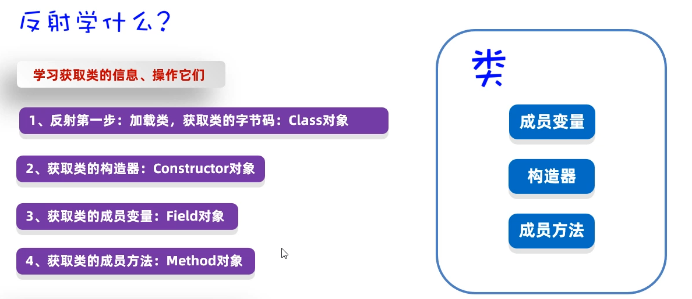

### 1.1 获取类的字节码

反射的第一步：是将字节码加载到内存，我们需要获取到的字节码对象。


比如有一个Student类，获取Student类的字节码代码有三种写法。不管用哪一种方式，获取到的字节码对象其实是同一个。

```java
public class Test1Class{
    public static void main(String[] args){
        Class c1 = Student.class;
        System.out.println(c1.getName()); //获取全类名
        System.out.println(c1.getSimpleName()); //获取简单类名
        
        Class c2 = Class.forName("com.itheima.d2_reflect.Student");
        System.out.println(c1 == c2); //true
        
        Student s = new Student();
        Class c3 = s.getClass();
        System.out.println(c2 == c3); //true
    }
}
```


### 1.2 获取类的构造器

同学们，上一节我们已经可以获取到类的字节码对象了。接下来，我们学习一下通过字节码对象获取构造器，并使用构造器创建对象。

获取构造器，需要用到Class类提供的几个方法，如下图所示：


想要快速记住这个方法的区别，给同学们说一下这些方法的命名规律，按照规律来记就很方便了。

```java
get:获取
Declared: 有这个单词表示可以获取任意一个，没有这个单词表示只能获取一个public修饰的
Constructor: 构造方法的意思
后缀s: 表示可以获取多个，没有后缀s只能获取一个
```

话不多少，上代码。假设现在有一个Cat类，里面有几个构造方法，代码如下

```java
public class Cat{
    private String name;
    private int age;
    
    public Cat(){
        
    }
    
    private Cat(String name, int age){
        
    }
}
```

- 1. 接下来，我们写一个测试方法，来测试获取类中所有的构造器

```java
public class Test2Constructor(){
    @Test
    public void testGetConstructors(){
        //1、反射第一步：必须先得到这个类的Class对象
        Class c = Cat.class;
        
        //2、获取类的全部构造器
        Constructor[] constructors = c.getDeclaredConstructors();
        //3、遍历数组中的每一个构造器对象。
        for(Constructor constructor: constructors){
            System.out.println(constructor.getName()+"---> 参数个数："+constructor.getParameterCount());
        }
    }
}
```

运行测试方法打印结果如下


- 2. 刚才演示的是获取Cat类中所有的构造器，接下来，我们演示单个构造器试一试

```java
public class Test2Constructor(){
    @Test
    public void testGetConstructor(){
        //1、反射第一步：必须先得到这个类的Class对象
        Class c = Cat.class;
        
        //2、获取类public修饰的空参数构造器
        Constructor constructor1 = c.getConstructor();
        System.out.println(constructor1.getName()+"---> 参数个数："+constructor1.getParameterCount());
        
        //3、获取private修饰的有两个参数的构造器，第一个参数String类型，第二个参数int类型
        Constructor constructor2 = 
            c.getDeclaredConstructor(String.class,int.class);
        
        System.out.println(constructor2.getName()+"---> 参数个数："+constructor1.getParameterCount());

    }
}
```

打印结果如下


### 1.3 反射获取构造器的作用

同学们，刚才上一节我们已经获取到了Cat类中的构造器。获取到构造器后，有什么作用呢？

其实构造器的作用：**初始化对象并返回**。

这里我们需要用到如下的两个方法，注意：这两个方法时属于Constructor的，需要用Constructor对象来调用。 


如下图所示，constructor1和constructor2分别表示Cat类中的两个构造器。现在我要把这两个构造器执行起来

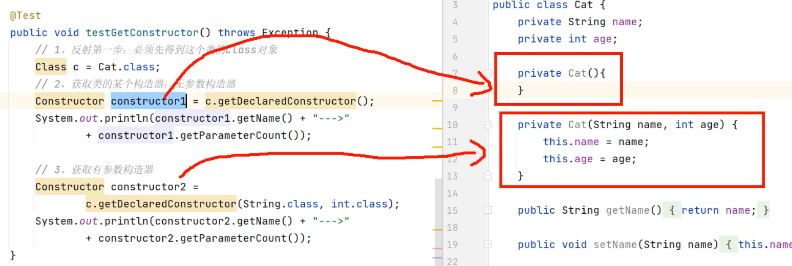

由于构造器是private修饰的，先需要调用`setAccessible(true)` 表示禁止检查访问控制，然后再调用`newInstance(实参列表)` 就可以执行构造器，完成对象的初始化了。

代码如下：为了看到构造器真的执行， 故意在两个构造器中分别加了两个打印语句

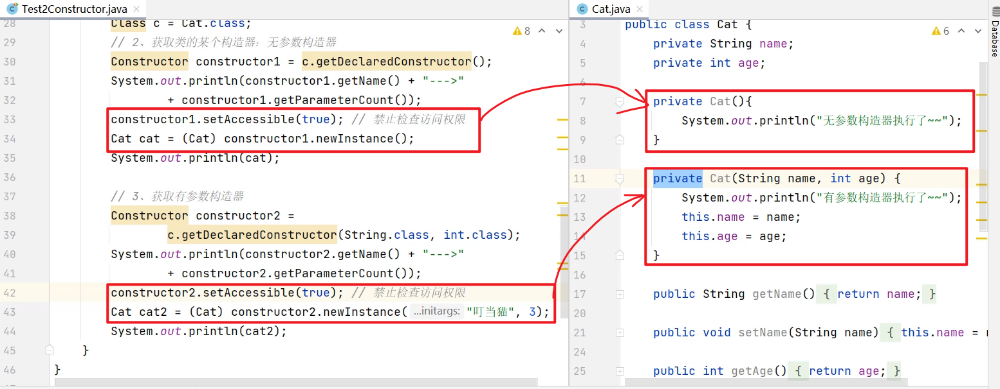

代码的执行结果如下图所示：


### 1.4 反射获取成员变量&使用

同学们，上一节我们已经学习了获取类的构造方法并使用。接下来，我们再学习获取类的成员变量，并使用。

其实套路是一样的，在Class类中提供了获取成员变量的方法，如下图所示。


这些方法的记忆规则，如下

```java
get:获取
Declared: 有这个单词表示可以获取任意一个，没有这个单词表示只能获取一个public修饰的
Field: 成员变量的意思
后缀s: 表示可以获取多个，没有后缀s只能获取一个
```

- 假设有一个Cat类它有若干个成员变量，用Class类提供 的方法将成员变量的对象获取出来。

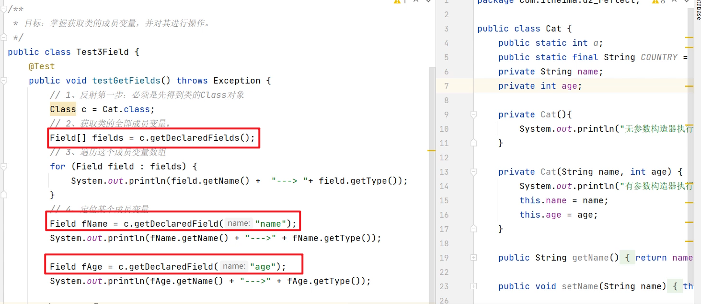

执行完上面的代码之后，我们可以看到控制台上打印输出了，每一个成员变量的名称和它的类型。


- 获取到成员变量的对象之后该如何使用呢？

在Filed类中提供给给成员变量赋值和获取值的方法，如下图所示。


再次强调一下设置值、获取值的方法时Filed类的需要用Filed类的对象来调用，而且不管是设置值、还是获取值，都需要依赖于该变量所属的对象。代码如下

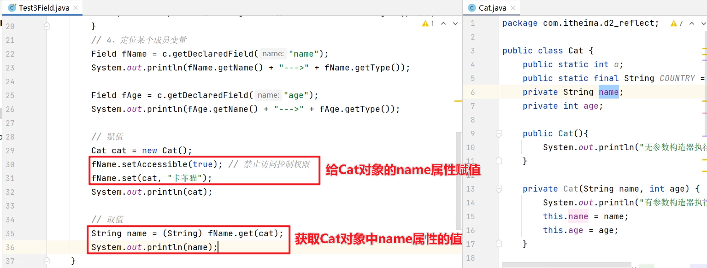

执行代码，控制台会有如下的打印


### 1.5 反射获取成员方法

各位同学，上面几节我们已经学习了反射获取构造方法、反射获取成员变量，还剩下最后一个就是反射获取成员方法并使用了。

在Java中反射包中，每一个成员方法用Method对象来表示，通过Class类提供的方法可以获取类中的成员方法对象。如下下图所示


接下来我们还是用代码演示一下：假设有一个Cat类，在Cat类中红有若干个成员方法

```java
public class Cat{
    private String name;
    private int age;
    
    public Cat(){
        System.out.println("空参数构造方法执行了");
    }
    
    private Cat(String name, int age){
        System.out.println("有参数构造方法执行了");
        this.name=name;
        this.age=age;
    }
    
    private void run(){
        System.out.println("(>^ω^<)喵跑得贼快~~");
    }
    
    public void eat(){
        System.out.println("(>^ω^<)喵爱吃猫粮~");
    }
    
    private String eat(String name){
        return "(>^ω^<)喵爱吃:"+name;
    }
    
    public void setName(String name){
        this.name=name;
    }
    public String getName(){
        return name;
    }
    public void setAge(int age){
        this.age=age;
    }
     public int getAge(){
        return age;
    }
}
```

接下来，通过反射获取Cat类中所有的成员方法，每一个成员方法都是一个Method对象

```java
public class Test3Method{
    public static void main(String[] args){
        //1、反射第一步：先获取到Class对象
        Class c = Cat.class;
        
        //2、获取类中的全部成员方法
        Method[] methods = c.getDecalaredMethods();
        
        //3、遍历这个数组中的每一个方法对象
        for(Method method : methods){
            System.out.println(method.getName()+"-->"+method.getParameterCount()+"-->"+method.getReturnType());
        }
    }
}
```

执行上面的代码，运行结果如下图所示：**打印输出每一个成员方法的名称、参数格式、返回值类型**


也能获取单个指定的成员方法，如下图所示


---

**获取到成员方法之后，有什么作用呢？**

在Method类中提供了方法，可以将方法自己执行起来。


下面我们演示一下，把`run()`方法和`eat(String name)`方法执行起来。看分割线之下的代码

```java
public class Test3Method{
    public static void main(String[] args){
        //1、反射第一步：先获取到Class对象
        Class c = Cat.class;
        
        //2、获取类中的全部成员方法
        Method[] methods = c.getDecalaredMethods();
        
        //3、遍历这个数组中的每一个方法对象
        for(Method method : methods){
            System.out.println(method.getName()+"-->"+method.getParameterCount()+"-->"+method.getReturnType());
        }
        
        System.out.println("-----------------------");
        //4、获取private修饰的run方法，得到Method对象
        Method run = c.getDecalaredMethod("run");
        //执行run方法,在执行前需要取消权限检查
        Cat cat = new Cat();
        run.setAccessible(true);
        Object rs1 = run.invoke(cat);
        System.out.println(rs1)
        
        //5、获取private 修饰的eat(String name)方法，得到Method对象
        Method eat = c.getDeclaredMethod("eat",String.class);
        eat.setAccessible(true);
        Object rs2 = eat.invoke(cat,"鱼儿");
        System.out.println(rs2)
    }
}
```

打印结果如下图所示：run()方法执行后打印`猫跑得贼快~~`，返回`null`； eat()方法执行完，直接返回`猫最爱吃:鱼儿`


### 1.6 反射的应用

各位小伙伴，按照前面我们学习反射的套路，我们已经充分认识了什么是反射，以及反射的核心作用是用来获取类的各个组成部分并执行他们。但是由于同学们的经验有限，对于反射的具体应用场景还是很难感受到的（这个目前没有太好的办法，只能慢慢积累，等经验积累到一定程度，就会豁然开朗了）。

我们一直说反射使用来写框架的，接下来，我们就写一个简易的框架，简单窥探一下反射的应用。反射其实是非常强大的，这个案例也仅仅值小试牛刀。

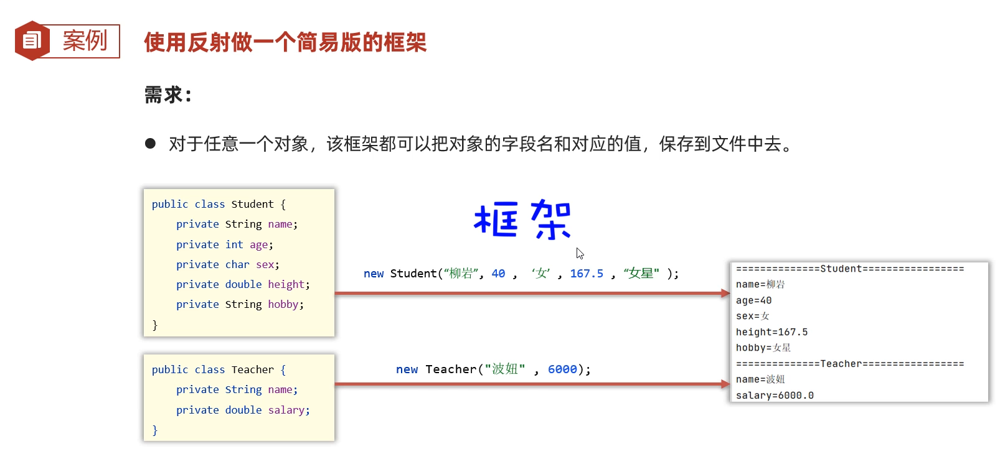

需求是让我们写一个框架，能够将任意一个对象的属性名和属性值写到文件中去。不管这个对象有多少个属性，也不管这个对象的属性名是否相同。

分析一下该怎么做

```java
1.先写好两个类，一个Student类和Teacher类
2.写一个ObjectFrame类代表框本架
	在ObjectFrame类中定义一个saveObject(Object obj)方法，用于将任意对象存到文件中去
	参数：Object obj: 就表示要存入文件中的对象
	
3.编写方法内部的代码，往文件中存储对象的属性名和属性值
	1)参数obj对象中有哪些属性，属性名是什么实现值是什么，中有对象自己最清楚。
	2)接着就通过反射获取类的成员变量信息了（变量名、变量值）
	3)把变量名和变量值写到文件中去
```

写一个ObjectFrame表示自己设计的框架，代码如下图所示

```java
public class ObjectFrame{
    public static void saveObject(Object obj) throws Exception{
        PrintStream ps = 
            new PrintStream(new FileOutputStream("模块名\\src\\data.txt",true));
        //1)参数obj对象中有哪些属性，属性名是什么实现值是什么，中有对象自己最清楚。
		//2)接着就通过反射获取类的成员变量信息了（变量名、变量值）
        Class c = obj.getClass(); //获取字节码
        ps.println("---------"+class.getSimpleName()+"---------");
        
        Field[] fields = c.getDeclaredFields(); //获取所有成员变量
		//3)把变量名和变量值写到文件中去
        for(Field field : fields){
            String name = field.getName();
            Object value = field.get(obj)+"";
            ps.println(name);
        }
        ps.close();
    }
}
```

使用自己设计的框架，往文件中写入Student对象的信息和Teacher对象的信息。

先准备好Student类和Teacher类

```java
public class Student{
    private String name;
    private int age;
    private char sex;
    private double height;
    private String hobby;
}
```

```java
public class Teacher{
    private String name;
    private double salary;
}
```

创建一个测试类，在测试中类创建一个Student对象，创建一个Teacher对象，用ObjectFrame的方法把这两个对象所有的属性名和属性值写到文件中去。

```java
public class Test5Frame{
    @Test
    public void save() throws Exception{
        Student s1 = new Student("黑马吴彦祖",45, '男', 185.3, "篮球，冰球，阅读");
        Teacher s2 = new Teacher("播妞",999.9);
        
        ObjectFrame.save(s1);
        ObjectFrame.save(s2);
    }
}
```

打开data.txt文件，内容如下图所示，就说明我们这个框架的功能已经实现了

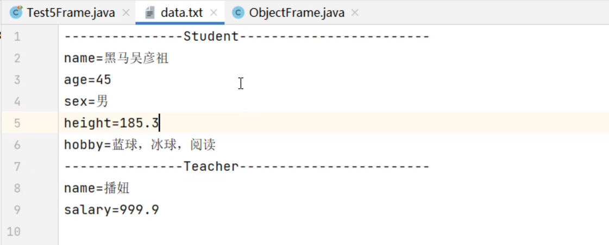

好了，同学们，恭喜大家！学习到这里，反射技术已经学习完毕了。

---


## 三、注解

### 3.1 认识注解&定义注解

各位小伙伴，接下来我们学习注解。注解和反射一样，都是用来做框架的，我们这里学习注解的目的其实是为了以后学习框架或者做框架做铺垫的。

那注解该怎么学呢？和反射的学习套路一样，我们先充分的认识注解，掌握注解的定义和使用格式，然后再学习它的应用场景。

> **先来认识一下什么是注解？**

**Java注解是代码中的特殊标记，比如@Override、@Test等，作用是：让其他程序根据注解信息决定怎么执行该程序。**

比如：Junit框架的@Test注解可以用在方法上，用来标记这个方法是测试方法，被@Test标记的方法能够被Junit框架执行。

再比如：@Override注解可以用在方法上，用来标记这个方法是重写方法，被@Override注解标记的方法能够被IDEA识别进行语法检查。


- **注解不光可以用在方法上，还可以用在类上、变量上、构造器上等位置。**

上面我们说的@Test注解、@Overide注解是别人定义好给我们用的，将来如果需要自己去开发框架，就需要我们自己定义注解。

> **接着我们学习自定义注解**

自定义注解的格式如下图所示


比如：现在我们自定义一个MyTest注解

```java
public @interface MyTest{
    String aaa();
    boolean bbb() default true;	//default true 表示默认值为true,使用时可以不赋值。
    String[] ccc();
}
```

定义好MyTest注解之后，我们可以使用MyTest注解在类上、方法上等位置做标记。注意使用注解时需要加@符号，如下

```java
@MyTest1(aaa="牛魔王",ccc={"HTML","Java"})
public class AnnotationTest1{
    @MyTest(aaa="铁扇公主",bbb=false, ccc={"Python","前端","Java"})
    public void test1(){
        
    }
}
```

注意：注解的属性名如何是value的话，并且只有value没有默认值，使用注解时value名称可以省略。比如现在重新定义一个MyTest2注解

```java
public @interface MyTest2{
    String value(); //特殊属性
    int age() default 10;
}
```

定义好MyTest2注解后，再将@MyTest2标记在类上，此时value属性名可以省略，代码如下

```java
@MyTest2("孙悟空") //等价于 @MyTest2(value="孙悟空")
@MyTest1(aaa="牛魔王",ccc={"HTML","Java"})
public class AnnotationTest1{
    @MyTest(aaa="铁扇公主",bbb=false, ccc={"Python","前端","Java"})
    public void test1(){
        
    }
}
```

到这里关于定义注解的格式、以及使用注解的格式就学习完了。

> **注解本质是什么呢？**

想要搞清楚注解本质是什么东西，我们可以把注解的字节码进行反编译，使用XJad工具进行反编译。经过对MyTest1注解字节码反编译我们会发现：

```java
1.MyTest1注解本质上是接口，每一个注解接口都继承子Annotation接口
2.MyTest1注解中的属性本质上是抽象方法
3.@MyTest1实际上是作为MyTest接口的实现类对象
4.@MyTest1(aaa="孙悟空",bbb=false,ccc={"Python","前端","Java"})里面的属性值，可以通过调用aaa()、bbb()、ccc()方法获取到。 【别着急，继续往下看，再解析注解时会用到】
```

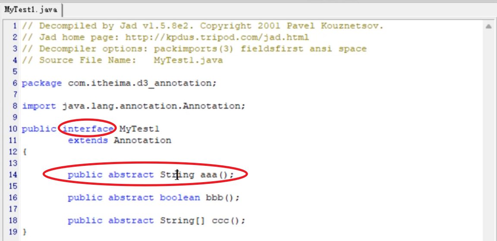


### 3.2 元注解

各位小伙伴，刚才我们已经认识了注解以及注解的基本使用。接下来我们还需要学习几种特殊的注解，叫做元注解。

> **什么是元注解？**

**元注解是修饰注解的注解**。这句话虽然有一点饶，但是非常准确。我们看一个例子


接下来分别看一下@Target注解和@Retention注解有什么作用，如下图所示

```java
@Target是用来声明注解只能用在那些位置，比如：类上、方法上、成员变量上等
@Retetion是用来声明注解保留周期，比如：源代码时期、字节码时期、运行时期
```


- @Target元注解的使用：比如定义一个MyTest3注解，并添加@Target注解用来声明MyTest3的使用位置

```java
@Target(ElementType.TYPE)	//声明@MyTest3注解只能用在类上
public @interface MyTest3{
    
}
```

接下来，我们把@MyTest3用来类上观察是否有错，再把@MyTest3用在方法上、变量上再观察是否有错


如果我们定义MyTest3注解时，使用@Target注解属性值写成下面样子

```java
//声明@MyTest3注解只能用在类上和方法上
@Target({ElementType.TYPE,ElementType.METHOD})	
public @interface MyTest3{
    
}
```

此时再观察，@MyTest用在类上、方法上、变量上是否有错


到这里@Target元注解的使用就演示完毕了。


- @Retetion元注解的使用：定义MyTest3注解时，给MyTest3注解添加@Retetion注解来声明MyTest3注解保留的时期

```java
@Retetion是用来声明注解保留周期，比如：源代码时期、字节码时期、运行时期
	@Retetion(RetetionPloicy.SOURCE): 注解保留到源代码时期、字节码中就没有了
	@Retetion(RetetionPloicy.CLASS): 注解保留到字节码中、运行时注解就没有了
	@Retetion(RetetionPloicy.RUNTIME)：注解保留到运行时期
	【自己写代码时，比较常用的是保留到运行时期】
```

```java
//声明@MyTest3注解只能用在类上和方法上
@Target({ElementType.TYPE,ElementType.METHOD})	
//控制使用了@MyTest3注解的代码中，@MyTest3保留到运行时期
@Retetion(RetetionPloicy.RUNTIME)
public @interface MyTest3{
    
}
```


### 3.3 解析注解

各位小伙伴，通过前面的学习我们能够自己定义注解，也能够把自己定义的注解标记在类上或者方法上等位置，但是总感觉有点别扭，给类、方法、变量等加上注解后，我们也没有干什么呀！！！

接下来，我们就要做点什么。我们可以通过反射技术把类上、方法上、变量上的注解对象获取出来，然后通过调用方法就可以获取注解上的属性值了。**我们把获取类上、方法上、变量上等位置注解及注解属性值的过程称为解析注解。**

解析注解套路如下

```java
1.如果注解在类上，先获取类的字节码对象，再获取类上的注解
2.如果注解在方法上，先获取方法对象，再获取方法上的注解
3.如果注解在成员变量上，先获取成员变量对象，再获取变量上的注解
总之：注解在谁身上，就先获取谁，再用谁获取谁身上的注解
```


解析来看一个案例，来演示解析注解的代码编写


按照需求要求一步一步完成

① 先定义一个MyTest4注解

```java
//声明@MyTest4注解只能用在类上和方法上
@Target({ElementType.TYPE,ElementType.METHOD})	
//控制使用了@MyTest4注解的代码中，@MyTest4保留到运行时期
@Retetion(RetetionPloicy.RUNTIME)
public @interface MyTest4{
    String value();
    double aaa() default 100;
    String[] bbb();
}
```

② 定义有一个类Demo

```java
@MyTest4(value="蜘蛛侠",aaa=99.9, bbb={"至尊宝","黑马"})
public class Demo{
    @MyTest4(value="孙悟空",aaa=199.9, bbb={"紫霞","牛夫人"})
    public void test1(){
        
    }
}
```

③ 写一个测试类AnnotationTest3解析Demo类上的MyTest4注解

```java
public class AnnotationTest3{
    @Test
    public void parseClass(){
        //1.先获取Class对象
        Class c = Demo.class;
        
        //2.解析Demo类上的注解
        if(c.isAnnotationPresent(MyTest4.class)){
            //获取类上的MyTest4注解
            MyTest4 myTest4 = (MyTest4)c.getDeclaredAnnotation(MyTest4.class);
            //获取MyTests4注解的属性值
            System.out.println(myTest4.value());
            System.out.println(myTest4.aaa());
            System.out.println(myTest4.bbb());
        }
    }
    
    @Test
    public void parseMethods(){
        //1.先获取Class对象
        Class c = Demo.class;
        
        //2.解析Demo类中test1方法上的注解MyTest4注解
        Method m = c.getDeclaredMethod("test1");
        if(m.isAnnotationPresent(MyTest4.class)){
            //获取方法上的MyTest4注解
            MyTest4 myTest4 = (MyTest4)m.getDeclaredAnnotation(MyTest4.class);
            //获取MyTests4注解的属性值
            System.out.println(myTest4.value());
            System.out.println(myTest4.aaa());
            System.out.println(myTest4.bbb());
        }
    }
}
```


### 3.4 注解的应用场景

各位同学，关于注解的定义、使用、解析注解就已经学习完了。接下来，我们再学习一下注解的应用场景，注解是用来写框架的，比如现在我们要模拟Junit写一个测试框架，要求有@MyTest注解的方法可以被框架执行，没有@MyTest注解的方法不能被框架执行。

第一步：先定义一个MyTest注解

```java
@Target(ElementType.METHOD)	
@Retetion(RetetionPloicy.RUNTIME)
public @interface MyTest{
    
}
```

第二步：写一个测试类AnnotationTest4，在类中定义几个被@MyTest注解标记的方法

```java
public class AnnotationTest4{
    @MyTest
    public void test1(){
        System.out.println("=====test1====");
    }
    
    @MyTest
    public void test2(){
        System.out.println("=====test2====");
    }
    

    public void test3(){
        System.out.println("=====test2====");
    }
    
    public static void main(String[] args){
        AnnotationTest4 a = new AnnotationTest4();
        
        //1.先获取Class对象
        Class c = AnnotationTest4.class;
        
        //2.解析AnnotationTest4类中所有的方法对象
        Method[] methods = c.getDeclaredMethods();
        for(Method m: methods){
            //3.判断方法上是否有MyTest注解，有就执行该方法
            if(m.isAnnotationPresent(MyTest.class)){
            	m.invoke(a);
        	}
        }
    }
}
```

恭喜小伙伴们，学习到这里，关于注解的使用就学会了(*^▽^*)


## 四、动态代理

### 4.1 动态代理介绍、准备功能

各位同学，这节课我们学习一个Java的高级技术叫做动态代理。首先我们认识一下代理长什么样？我们以大明星“杨超越”例。

假设现在有一个大明星叫杨超越，它有唱歌和跳舞的本领，作为大明星是要用唱歌和跳舞来赚钱的，但是每次做节目，唱歌的时候要准备话筒、收钱，再唱歌；跳舞的时候也要准备场地、收钱、再唱歌。杨超越越觉得我擅长的做的事情是唱歌，和跳舞，但是每次唱歌和跳舞之前或者之后都要做一些繁琐的事情，有点烦。于是杨超越就找个一个经济公司，请了一个代理人，代理杨超越处理这些事情，如果有人想请杨超越演出，直接找代理人就可以了。如下图所示

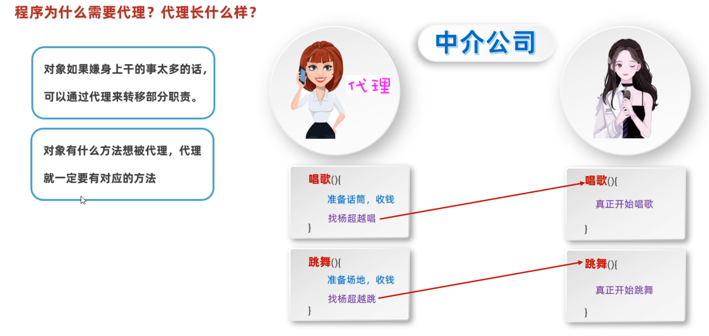

我们说杨超越的代理是中介公司派的，那中介公司怎么知道，要派一个有唱歌和跳舞功能的代理呢？

解决这个问题，Java使用的是接口，杨超越想找代理，在Java中需要杨超越实现了一个接口，接口中规定要唱歌和跳舞的方法。Java就可以通过这个接口为杨超越生成一个代理对象，只要接口中有的方法代理对象也会有。

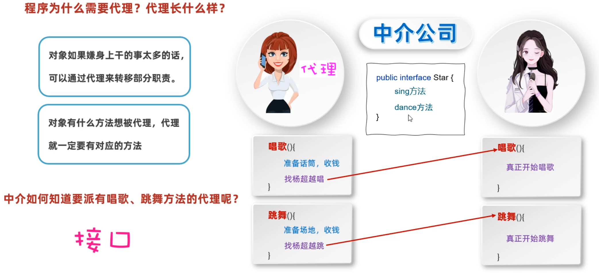

接下来我们就先把有唱歌和跳舞功能的接口，和实现接口的大明星类定义出来。

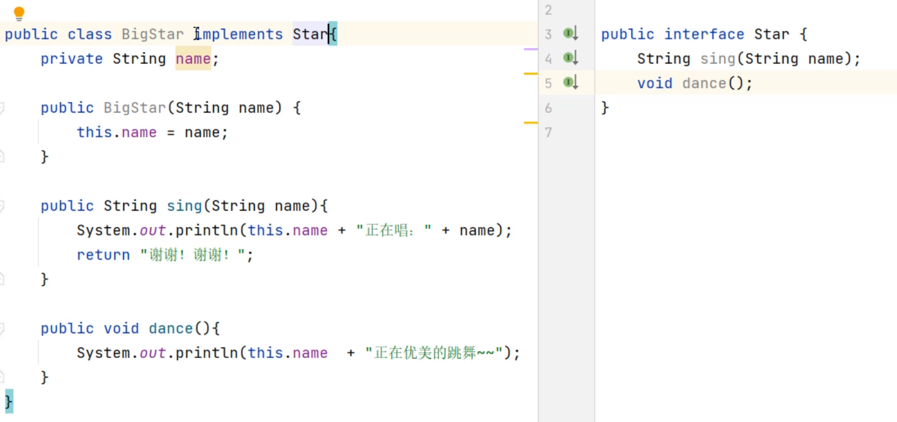

### 4.2 生成动态代理对象

下面我们写一个为BigStar生成动态代理对象的工具类。这里需要用Java为开发者提供的一个生成代理对象的类叫Proxy类。

通过Proxy类的newInstance(...)方法可以为实现了同一接口的类生成代理对象。 调用方法时需要传递三个参数，该方法的参数解释可以查阅API文档，如下。


```java
public class ProxyUtil {
    public static Star createProxy(BigStar bigStar){
       /* newProxyInstance(ClassLoader loader,
                Class<?>[] interfaces,
                InvocationHandler h)
                参数1：用于指定一个类加载器
                参数2：指定生成的代理长什么样子，也就是有哪些方法
                参数3：用来指定生成的代理对象要干什么事情
                */
        // Star starProxy = ProxyUtil.createProxy(s);
        // starProxy.sing("好日子") starProxy.dance()
        Star starProxy = (Star) Proxy.newProxyInstance(ProxyUtil.class.getClassLoader(),
                new Class[]{Star.class}, new InvocationHandler() {
                    @Override // 回调方法
                    public Object invoke(Object proxy, Method method, Object[] args) throws Throwable {
                        // 代理对象要做的事情，会在这里写代码
                        if(method.getName().equals("sing")){
                            System.out.println("准备话筒，收钱20万");
                        }else if(method.getName().equals("dance")){
                            System.out.println("准备场地，收钱1000万");
                        }
                        return method.invoke(bigStar, args);
                    }
                });
        return starProxy;
    }
}
```

调用我们写好的ProxyUtil工具类，为BigStar对象生成代理对象

```java
public class Test {
    public static void main(String[] args) {
        BigStar s = new BigStar("杨超越");
        Star starProxy = ProxyUtil.createProxy(s);

        String rs = starProxy.sing("好日子");
        System.out.println(rs);

        starProxy.dance();
    }
}
```

运行测试类，结果如下图所示


恭喜同学们，当你把上面的案例写出来，并且理解，那么动态代理的基本使用就学会了。


### 4.3 动态代理应用

学习完动态代理的基本使用之后，接下来我们再做一个应用案例。

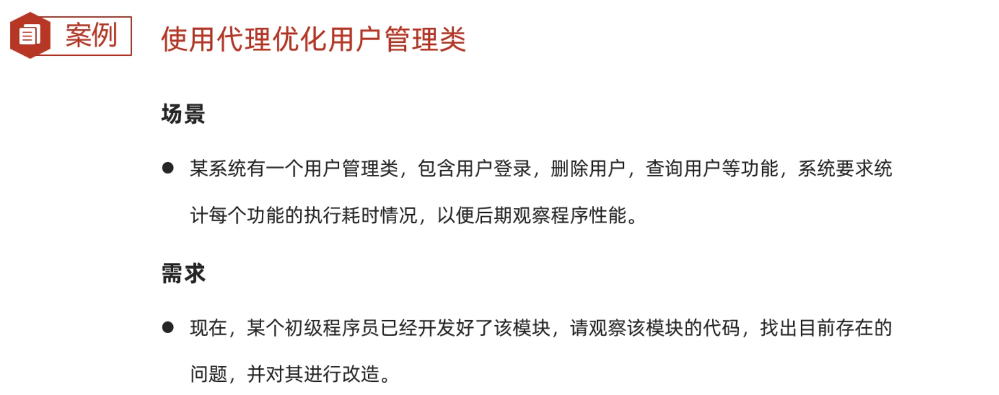

现有如下代码

```java
/**
 *  用户业务接口
 */
public interface UserService {
    // 登录功能
    void login(String loginName,String passWord) throws Exception;
    // 删除用户
    void deleteUsers() throws Exception;
    // 查询用户，返回数组的形式。
    String[] selectUsers() throws Exception;
}
```

下面有一个UserService接口的实现类，下面每一个方法中都有计算方法运行时间的代码。

```java
/**
 * 用户业务实现类（面向接口编程）
 */
public class UserServiceImpl implements UserService{
    @Override
    public void login(String loginName, String passWord) throws Exception {
        long time1 = System.currentTimeMillis();
        if("admin".equals(loginName) && "123456".equals(passWord)){
            System.out.println("您登录成功，欢迎光临本系统~");
        }else {
            System.out.println("您登录失败，用户名或密码错误~");
        }
        Thread.sleep(1000);
        long time2 = System.currentTimeMillis();
        System.out.println("login方法耗时："+(time2-time1));
    }

    @Override
    public void deleteUsers() throws Exception{
        long time1 = System.currentTimeMillis();
        System.out.println("成功删除了1万个用户~");
        Thread.sleep(1500);
        long time2 = System.currentTimeMillis();
        System.out.println("deleteUsers方法耗时："+(time2-time1));
    }

    @Override
    public String[] selectUsers() throws Exception{
		long time1 = System.currentTimeMillis();
        System.out.println("查询出了3个用户");
        String[] names = {"张全蛋", "李二狗", "牛爱花"};
        Thread.sleep(500);
		long time2 = System.currentTimeMillis();
        System.out.println("selectUsers方法耗时："+(time2-time1));
        return names;
    }
}
```

观察上面代码发现有什么问题吗？

我们会发现每一个方法中计算耗时的代码都是重复的，我们可是学习了动态代理的高级程序员，怎么能忍受在每个方法中写重复代码呢！况且这些重复的代码并不属于UserSerivce的主要业务代码。


所以接下来我们打算，把计算每一个方法的耗时操作，交给代理对象来做。

先在UserService类中把计算耗时的代码删除，代码如下

```java
/**
 * 用户业务实现类（面向接口编程）
 */
public class UserServiceImpl implements UserService{
    @Override
    public void login(String loginName, String passWord) throws Exception {
        if("admin".equals(loginName) && "123456".equals(passWord)){
            System.out.println("您登录成功，欢迎光临本系统~");
        }else {
            System.out.println("您登录失败，用户名或密码错误~");
        }
        Thread.sleep(1000);
    }

    @Override
    public void deleteUsers() throws Exception{
        System.out.println("成功删除了1万个用户~");
        Thread.sleep(1500);
    }

    @Override
    public String[] selectUsers() throws Exception{

        System.out.println("查询出了3个用户");
        String[] names = {"张全蛋", "李二狗", "牛爱花"};
        Thread.sleep(500);

        return names;
    }
}
```

然后为UserService生成一个动态代理对象，在动态代理中调用目标方法，在调用目标方法之前和之后记录毫秒值，并计算方法运行的时间。代码如下

```java
public class ProxyUtil {
    public static UserService createProxy(UserService userService){
        UserService userServiceProxy
            = (UserService) Proxy.newProxyInstance(
            ProxyUtil.class.getClassLoader(),
            new Class[]{UserService.class}, 
            new InvocationHandler() {
                                                                            			@Override
            public Object invoke(                                                                             Object proxy, 
                              Method method, 
                                  Object[] args) throws Throwable {                             if(
                    method.getName().equals("login") ||                                             method.getName().equals("deleteUsers")||
                    method.getName().equals("selectUsers")){
                    //方法运行前记录毫秒值         
                    long startTime = System.currentTimeMillis();
                    //执行方法
                    Object rs = method.invoke(userService, args);
                    //执行方法后记录毫秒值
                    long endTime = System.currentTimeMillis();

                    System.out.println(method.getName() + "方法执行耗时：" + (endTime - startTime)/ 1000.0 + "s");
                    return rs;
               }else {
                    Object rs = method.invoke(userService, args);
                    return rs;                                                                }
           }                                                                 });
        //返回代理对象
        return userServiceProxy;
    }
}
```

在测试类中为UserService创建代理对象

```java
/**
 * 目标：使用动态代理解决实际问题，并掌握使用代理的好处。
 */
public class Test {
    public static void main(String[] args) throws Exception{
        // 1、创建用户业务对象。
        UserService userService = ProxyUtil.createProxy(new UserServiceImpl());

            // 2、调用用户业务的功能。
            userService.login("admin", "123456");
            System.out.println("----------------------------------");

            userService.deleteUsers();
            System.out.println("----------------------------------");

            String[] names = userService.selectUsers();
            System.out.println("查询到的用户是：" + Arrays.toString(names));
            System.out.println("----------------------------------");

    }
}
```

执行结果如下图所示

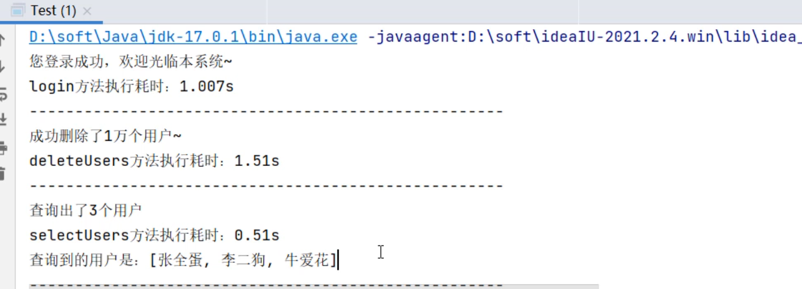

动态代理对象的执行流程如下图所示，每次用代理对象调用方法时，都会执行InvocationHandler中的invoke方法。

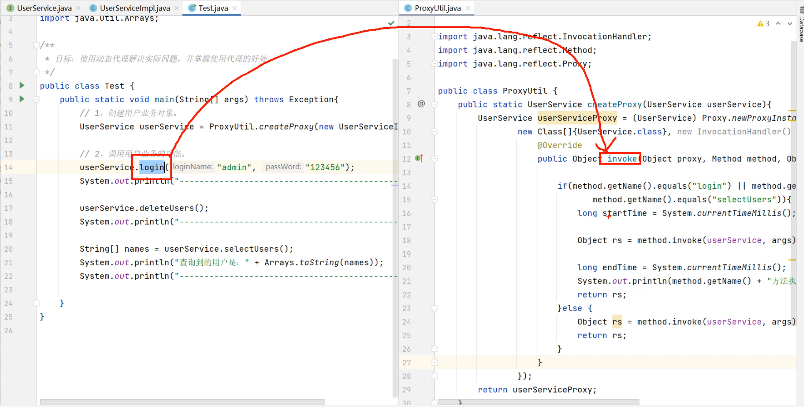

恭喜同学们，动态代理我们已经学习完了。到此整个JavaSE的课程也学习完了。

