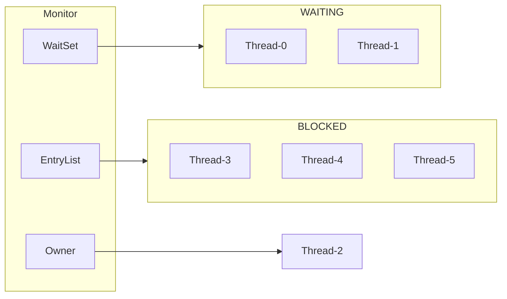

# `Java` 对象头

以32为虚拟机、普通对象头为例

对象头包含：`Mark Word: 32bit`, `Klass Word: 32bit
- `Mark Word`：哈希码、GC年龄、锁状态（会根据锁不同切换状态）
- `Klass Word`：指向对象所属类的元数据，JVM通过它知道对象是哪个类的实例

Mark Word 在不同锁状态下的结构：

| 锁状态             | 二进制后缀 | 字段结构描述                                                         |
| --------------- | ----- | -------------------------------------------------------------- |
| **无锁（Normal）**  | `01`  | `hashcode:25` \| `age:4` \| `biased_lock:0` \| `01`            |
| **偏向锁（Biased）** | `01`  | `thread:23` \| `epoch:2` \| `age:4` \| `biased_lock:1` \| `01` |
| **轻量级锁**        | `00`  | `ptr_to_lock_record:30` \| `00`                                |
| **重量级锁**        | `10`  | `ptr_to_heavyweight_monitor:30` \| `10`                        |
| **GC 标记（可回收）**  | `11`  | _空_ \| `11`                                                    |
- `hashcode`: 对象的哈希码（如果调用过 `hashCode()`）。
- `age`: GC 分代年龄（对象经历过几次 Minor GC）。
- `biased_lock`: 是否启用偏向锁（1 表示偏向）。
- `thread`: 偏向锁中记录的线程 ID。
- `epoch`: 偏向锁的时间戳（用于偏向撤销判定）。
- `ptr_to_lock_record`: 指向轻量级锁记录（栈中的 Lock Record）。
- `ptr_to_heavyweight_monitor`: 指向 Monitor 对象（用于重量级锁）。

# `Monitor`

Monitor：监视器、管程

每个 Java 对象可以和一个 Monitor 关联，若用 `synchronized` 给对象上锁（重量级锁）之后，该对象头中的 Mark Word 中就被设置指向 Monitor 对象。

- 刚开始 Monitor 中 Owner 为 null 
- 当 Thread-2 执行 `synchronized(obj)` 就会将 Monitor 的所有者 Owner 置为 Thread-2，Monitor中只能有一 个 Owner 
- 在 Thread-2 上锁的过程中，如果 Thread-3，..., Thread-5 也来执行 `synchronized(obj)`，就会进入 EntryList BLOCKED 
- Thread-2 执行完同步代码块的内容，然后唤醒 EntryList 中等待的线程来竞争锁，竞争时是非公平的 
- 图中 WaitSet 中的 Thread-0，Thread-1 是之前获得过锁，但条件不满足进入 WAITING 状态的线程，后面讲 wait-notify 时会分析

# `synchronized` 进阶原理

## 1. 轻量级锁

场景：当多个线程获取对象锁时，加锁时间是错开的（**没有竞争锁**），则可以使用轻量级锁优化。

- 创建 **锁记录（Lock Record）** 对象，每个线程都的栈帧都会包含一个锁记录的结构，内部可以存储锁定对象的 Mark Word
- 让锁记录中 Object reference 指向锁对象，并尝试用 cas 替换 Object 的 Mark Word，将 Mark Word 的值存 入锁记录
![[Pasted image 20250418102916.png]]

- 如果 cas 替换成功，对象头中存储锁记录地址和状态 00 ，表示由该线程获取到锁对象
![[Pasted image 20250418102937.png]]

- 如果 cas 失败，有两种情况
情况一：锁重入，那么再添加一条 Lock Record 作为重入的计数
![[Pasted image 20250418102947.png]]

情况二：其他线程持有对象锁，出现了竞争，进入**锁膨胀过程**

- 当退出 synchronized 代码块（解锁时）如果有取值为 null 的锁记录，表示有重入，这时重置锁记录，表示重 入计数减
- 当退出 synchronized 代码块（解锁时）锁记录的值不为 null，这时使用 cas 将 Mark Word 的值恢复给对象头
	- 成功，则解锁成功 
	- 失败，说明轻量级锁进行了锁膨胀或已经升级为重量级锁，进入**重量级锁解锁流程**

## 2. 锁膨胀

## 3. 自旋优化